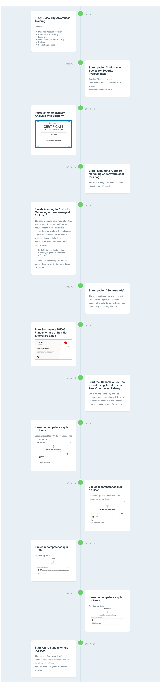

The overall goal og 2021 for me is to be better to prioritze personal growth. 
Below I will attempt to keep track of what I do, when and why, to track my growth.

### Aspects to grow

There is no specifics to what I want to grow around nor any topics that is more valuable than others. The goal og 2021 is simply to gain more knowledge and grow both personally and professionally

#### Acquirred knowledge

- [X] Basic knowledge og `Volatility` and how to use the program to inspect memory dumps
- [X] Deeper understanding of the proper reasons behind why we act as we do and how we can use this knowledge to promote the actions we want

### Timeline

<a href="../img/timeline.png" target="_blank">See the bigger timeline here</a>

### Remember list

- [ ] Mainframe Basics for Security Professionals (requires z/OS VM)
- [ ] Evil Mainframe pentest course (requires z/OS VM)
- [ ] Finish OSCP PDF and videos
- [ ] OSCP Certification
- [ ] (ISC)^2 Learning course: "DevSecOps: Integrating Security into DevOps"
- [ ] (ISC)^2 Learning course: "Introduction to the NIST Cybersecurity Framework"
- [ ] (ISC)^2 Learning course: "Introductory File System Forensics"
- [ ] (ISC)^2 Learning course: "Assessing Application Security"
- [ ] (ISC)^2 Learning course: "Strengthening Interpersonal Skills"
- [ ] Book: Reversing Secrets of Reverse Engineering
- [ ] Book: Practical Reverse Engineering
- [ ] Book: Advanced Penetration Testing
- [ ] Book: The Art of Memory Forensics
- [ ] Book: Security Engineering
- [ ] Book: Sicak Engineering the science of Human Hacking
- [ ] Book: Wireshark for Security Professionals
- [ ] Book: Threat modeling
- [ ] Book: Investigating Cryptocurrencies
- [ ] Book: Tribe of Hackers Red Team
- [ ] Book: The Shellcoder's Handbook
- [ ] Book: Cryptography Engineering
- [ ] Book: Cybersecurity Blue Team Toolkit
- [ ] Book: Applied Cryptography
- [ ] Book: Secrets & lies
- [ ] Book: Tribe of Hackers
- [ ] Book: The Web Application Hacker's Handbook
- [ ] Book: Cryptography Apocalypse
- [ ] Book: I have Root
- [ ] Book: Malware Analyst's Cookbook
- [ ] Udemy: Expert Malware Analysis and Reverse Engineering
- [ ] Udemy: Windows Privilege Escalation for Beginners
- [ ] Udemy: CompTIA CySA+
- [ ] Udemy: CompTIA Pentest+
- [ ] Udemy: CompTIA Security+

### References

- Jytte fra Marketing er desværre gået for i dag (ISBN: 9788702243635, [link](https://www.saxo.com/dk/jytte-fra-marketing-er-desvaerre-gaaet-for-i-dag_morten-munster_lydbog-download_9788702243635))
- Mainframe Basics for Security Professionals (ISBN: 9780133763041, [link](https://www.amazon.com/Mainframe-Basics-Security-Professionals-paperback/dp/0133763048))
- Supertrends - 50 ting, du bør vide om fremtiden (ISBN: 9788740057621, [link](https://www.saxo.com/dk/supertrends_lars-tvede_lydbog-download_9788740057621))

