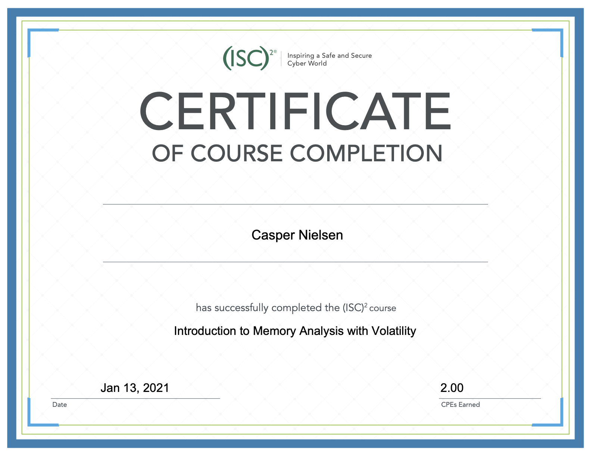
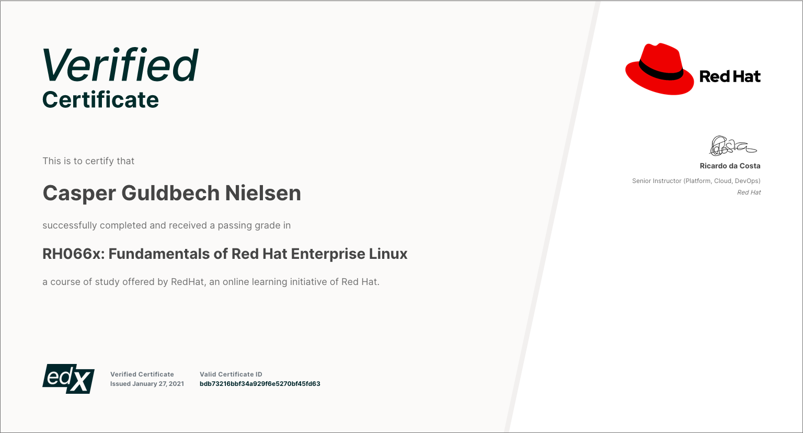
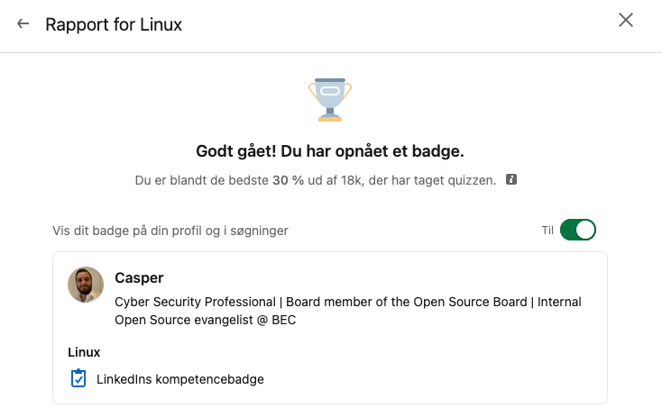
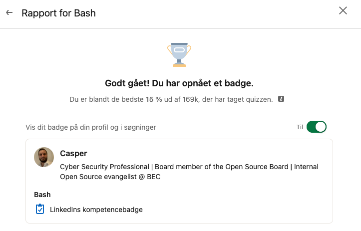
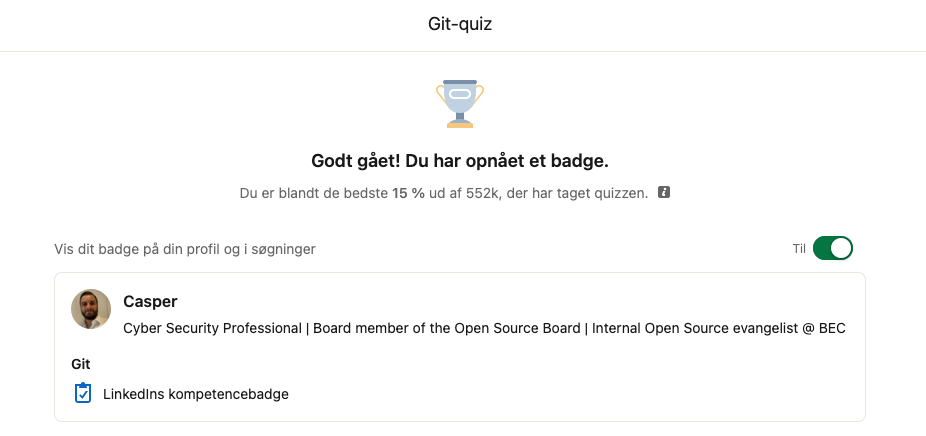
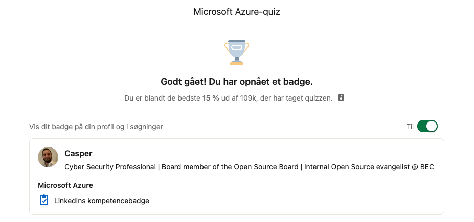

## 2021-01-11: (ISC)^2 Security Awareness Training

Included:

- Data and Account Security
- Importance of Security
- Passwords
- Network and Movile Security
- Malware
- Social Engineering

## 2021-01-11: Start reading "Mainframe Basics for Security Professionals"

Reached Chapter 1, page 6.  
From here on I need access to a z/OS system.  
Requested access via work.

## 2021-01-13: Introduction to Memory Analysis with Volatility

 

## 2021-01-16: Start listening to "Jytte fra Marketing er desværre gået for i dag"

The book is being consumed via sound. Listening on 1.25 speed. 

## 2021-01-17: Finish listening to "Jytte fra Marketing er desværre gået for i dag"

The book highlights some very interesting aspects about Behaviour and how we design - mostly from a leadership perspective - our goals, vision and actions to properly get the results we want to achieve: Change in behaviour.  
The book has many references to the 2 ways af action:  

1. By habbit (no reflective thinking)
2. By analysing the action (much reflection)

And why we must design for the first action where we most often try to design for the 2nd. 

## 2021-01-17: Start reading "Supertrends"

The book resides around analysing history from a technological advancement standpoint to better be able to foresee the future. Very interesting thoughts.

## 2021-01-24: Start & complete RH066x Fundamentals of Red Hat Enterprise Linux

## 2021-01-25: Start the 'Become a DevOps expert using Terraform on Azure' course on Udemy

While writing on the blog and also pursuing more automation with Terraform I came to the conclusion that I needed more understanding about `Terraform`.

## 2021-01-27: LinkedIn competence quiz on Linux

Score amongst top 30% to get a badge and here we are :-)

## 2021-01-28: LinkedIn competence quiz on Bash

And here I got even better than 30% ranking up on top 15%!

## 2021-01-28: LinkedIn competence quiz on Git

Another top 15%!

## 2021-01-28: LinkedIn competence quiz on Azure

Another top 15%!

## 2021-01-28: Start Azure Fundamentals (AZ-900)

The course is free to enroll and can be found at https://www.microsoft.com/en-ie/training-days#azure  
The free event also yields a free exam voucher.